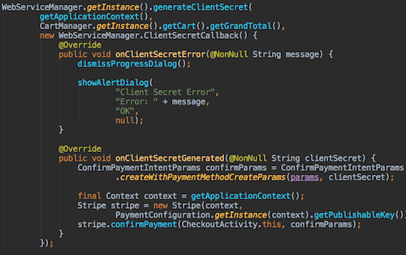
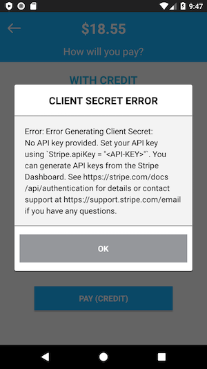
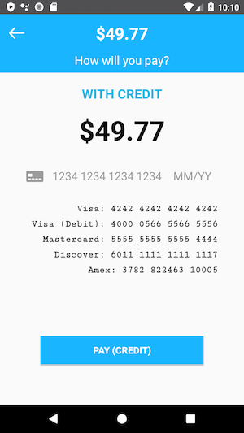

# SkeletonPaymentApp-Senior
This App is intended for Senior candidates. There are Android and iOS variants of this mobile payment App in the respective project directories. This application may include intentional compiler errors out-of-the box, and many of the functions and screens described below are currently not implemented.

| Login Screen | Order Entry |
| :---: | :---: |
 | 

# First Steps: Repo & Project Setup
* Create your own repository to store this project and all of your work.  
* Clone this repository (**SkeletonPaymentApp-Senior**) to your local machine, and then push all the contents to your repository using the instructions and CLI commands below for guidance:  

```diff
+ # Navigate to your Github dashboard. Go to 'Your Repositories'.
+ # Create a New Repository. Name it anything you'd like.
+ # You can make it public or private.
+ # Do not initialize the repository with a README.
+ # Do not add a .gitignore. Do not add a license.

+ # Clone this source repo onto your local machine.
git clone git@github.com:HelloImKevo/SkeletonPaymentApp-Senior.git

+ # Navigate into the new Git project directory.
cd SkeletonPaymentApp-Senior

+ # Check what the current remote repository URL is:
git config --get remote.origin.url

+ # Change the remote repository URL to your personal repository:
git remote set-url origin git@github.com:YOUR_USERNAME/YOUR_REPOSITORY.git
git config --get remote.origin.url

+ # Push the entire contents of the Groovy Mobile Payments project to your personal repository:
git push

+ # If you want to validate your Git environment is set up correctly, make a change to any file, then:
git add .
git commit -a -m "Minor update to <file_name> file"

+ # Should say something like 'Your branch is ahead of 'origin/master' by 1 commit'.
git status

+ # Push your new commit to your remote Git repository for funsies.
git push
```  

* More repository management discussions: https://stackoverflow.com/questions/18200248/cloning-a-repo-from-someone-elses-github-and-pushing-it-to-a-repo-on-my-github
* Your repository can be **public** or **private**, but if it's private you'll need to adjust the repository settings to invite one or two of us as collaborators so we can review your commits.
* Create a **Stripe Developer Account** over at: https://dashboard.stripe.com/register  
* Grab your **Publishable** and **Secret** API keys from your dashboard: https://dashboard.stripe.com/test/apikeys  
* The Stripe SDK architecture is built around the expectation of using a Client-Server model, where the Client (Mobile App) uses a **Publishable** API key, and the Server uses a **Secret** API key to generate a **Client Secret** string. We don't have a Server for this test application, so we emulate the "Server" within our app. The Android and iOS applications both use asynchronous utilities for generating a **Client Secret** using the Stripe **Secret** API key.  

### [[ Android Project Setup & Code Style ]](Android/README.md)

### [[ iOS Project Setup & Code Style ]](iOS/README.md)

# Expectations
* Okay, **phew**. If you made it this far, you're in good shape :+1: hopefully that stuff didn't take too much time (it gets easier with practice).  
* This project is comes with a **[Business Requirements Document (BRD)](#business-requirements-document-brd)** that is modeled after real-world business requirements. It is effectively a coding assessment designed to help us identify your **Skills** and **Areas of Expertise** and **Attention to Detail**, while providing you a little bit of exposure to the payments industry and our **Git Workflow**.  
* We recommend spending **about 8 Hours** implementing solutions to any number of the **[Business Requirements](#business-requirements-document-brd)** listed below, but you are welcome to spend as much time as you'd like to accomplish any number of the tasks.  
* It is suggested that you work on tasks that demonstrate your strengths as a developer. For example, if you've got a lot of familiarity with **Encryption & Decryption** mechanisms, you might want to implement an encryption framework for the `User.Password` model data for the login flow. Alternatively, if you enjoy working with multi-threaded systems, feel free to rewrite the **SQL Database** implementation or the asynchronous network calls to the Stripe API.  

# Submission Guidelines  
* After you push commits to the project, our team will review your work and provide **Constructive Feedback** on how to improve your code readability, code organization, your approach to solving the problem, or sometimes we will just banter about random technology trends or the latest data breaches.  
* Oftentimes, code style is **Subjective**, and there's no right or wrong answer, and that's okay! If you disagree with our feedback, let us know why you wrote it that way - we look forward to learning new things and better practices from you :grin:  
* Code style and consistency is important to us - we take pride in every line of code we write, and encourage you to do the same. The **Android** team generally adheres to all AOSP Contributor Guidelines (See: [Android README](Android/README.md)) and the **iOS** team generally adheres to all iOS Contributor Guidelines (See: [iOS README](iOS/README.md)).  
* Android submissions can be written in **Kotlin** or **Java**.  
* iOS submissions can be written in **Swift** or **Objective-C**.  
* We are more interested in the **Quality** of your submissions, rather than the quantity of submissions.  Quality is assessed using some of these parameters:  
  * Is the code style consistent? (Do variables follow the same standard conventions? Is the code formatted with the same indentation levels?)  
  * Are the methods / functions designed to be small and focused? (It is, however, recognized that long methods are sometimes appropriate.)  
  * Is complex or obscure logic documented?
  * Does the code architecture follow recommended developer patterns?  
  * Does the Android code use K&R bracing style? https://en.wikipedia.org/wiki/Indentation_style#K&R_style  
  * Does the iOS code use Allman bracing style? https://en.wikipedia.org/wiki/Indentation_style#Allman_style  
* Like many other successful companies, we aim to follow a **Test-Driven Development** paradigm. Unit Tests and Instrumentation tests are strongly encouraged!  

# Questions or Concerns?  
* For any company-related or interview-related questions, reach out to your point-of-contact (likely a **Hiring Manager**).  
* If you would like to keep your work in a **private repository**, please notify the **Hiring Manager**, and they will provide you a list of email addresses for the code reviewers that you'll need to invite as collaborators to your repository.  
* If you have **technical questions** or need assistance with this project, ask the **Hiring Manager**, and they will provide you with the email addresses of one of our team members, and you can email us your question directly, and we will do our best to help.  

# Business Requirements Document (BRD)  

## Task ID: #001 - Main Dashboard Crash  
#### Estimated LOE (Level of Effort): 2 Hours  

[//]: # (Line breaks must be added to control text wrapping for multi-line rows, otherwise the image will get squashed)

| Requirements | Business Mock |
| :--- | --- |
| The application currently **crashes** when a `Placeholder` button is clicked on <br>the main dashboard.<br><br>Design an alert dialog that is shown with an `"Under Construction"` type <br>of message instead of crashing. |  |

## Task ID: #002 - Generating Test Data & Populating the Database
#### Estimated LOE (Level of Effort): 2 Hours  

## Task ID: #003 - Product List Facelift  
#### Estimated LOE (Level of Effort): 2 Hours  

| Requirements | Business Mock |
| :--- | --- |
| Users of this application have complained that the Product list looks very <br>bland. (We've gotten lots of negative feedback on the Google Play Store and Apple App Store)<br><br>Update the style of the products to match this new mock from the Design <br>team as closely as possible (or use your creativity to implement a better design). |  |

## Task ID: #004 - Language Translation of Your Choice
#### Estimated LOE (Level of Effort): 2 Hours  

| Requirements | Business Mock |
| :--- | --- |
| Google Play Store users have left us lots of negative feedback because the <br>application only supports English and Spanish.<br><br>For this task, localize all of the app's string resources to another language<br>of your choice. Go through the app and extract any hard-coded strings as necessary.<br><br>**You do not need to worry about the names and descriptions of database entities.** |  |
| The system language can be changed at Runtime under System settings. |  |

## Task ID: #005 - Database-Driven Payment Types  
#### Estimated LOE (Level of Effort): 4 Hours  

## Task ID: #006 - Display the Order History  
#### Estimated LOE (Level of Effort): 3 Hours  

## Task ID: #007 - Checkout with Cash Payments!  
#### Estimated LOE (Level of Effort): 4 Hours  

| Requirements | Business Mock |
| :--- | --- |
| Currently, there is no way to complete the Checkout flow, because we haven't <br>implemented **Cash** or Credit support. The "Pay with Cash" screen has a 10-digit <br>Keypad, but it isn't wired up. <br><br>**Bonus points for allowing the User to over-pay or under-pay, and show the <br>User how much Change is Due to the Customer.** |  |

## Task ID: #008 - Generate the Client Secret... On the Client!  
#### Estimated LOE (Level of Effort): 2 Hours  

| Requirements | Code Sample / Business Mock |
| :--- | :---: |
| We don't have a Server for this test application, so we emulate the "Server" <br>within our app. The Android and iOS applications both use asynchronous utilities <br>for generating a **Client Secret** using your Stripe **Secret** API key. Most of the <br>necessary code already exists, and there is an **Instrumentation Test** available for <br>you to get an idea of how this works - you just need to call our asynchronous <br>method and handle the resulting callbacks. |  |
| Be sure to gracefully handle any errors that might occur. |  |

## Task ID: #009 - Pay with a Credit Card Number  
#### Depends on Client Secret mechanism
#### Estimated LOE (Level of Effort): 4 Hours  

| Requirements | Business Mock |
| :--- | --- |
| Currently, there is no way to complete the Checkout flow, because we haven't <br>implemented Cash or **Credit** support. The "Pay with Credit" screen has a Stripe <br>`CardInputWidget`, but it isn't wired up. <br><br>Every Stripe payment requires a **Client Secret** string to be generated (the **Client <br>Secret** is derived from the transaction amount, the currency type, and your <br>**Publishable API Key**), so you'll need to generate a **Client Secret** when the User <br>clicks the `PAY (CREDIT)` button, and then process the payment using <br>`com.stripe.android.Stripe.confirmPayment()`. <br><br>References: <br>https://stripe.com/docs/payments/accept-a-payment#android  <br>https://stripe.com/docs/testing   |  |
| Consider logging or displaying the response from Stripe. |  |

## Task ID: #009 - User Database Schema  
#### Estimated LOE (Level of Effort): 6 Hours  

## Task ID: #010 - User Password Encryption & Decryption  
#### Estimated LOE (Level of Effort): 6 Hours  

## Task ID: #011 - Tables, and Charts, and Graphs, Oh My!  
#### Estimated LOE (Level of Effort): 8 Hours  

## Git Workflow References

Useful git commands for quickly traversing repos:  
```
# Pushing from a local repository to GitHub hosted remote
git remote add origin git@github.com:USERNAME/REPO-NAME.git

# Clone your fork to your local machine
git clone git@github.com:USERNAME/FORKED-PROJECT.git
```

## GitHub Standard Fork & Pull Request Workflow  
Useful link about project forks:  
https://gist.github.com/Chaser324/ce0505fbed06b947d962  

# Useful References

### Game-Icons.net  
Many thanks to the contributors and maintainers over at game-icons.net :joy: it has been an extremely helpful resource in prototyping mobile applications.  
https://game-icons.net  

### Stripe
https://stripe.com/docs/development  

### Retrofit
https://square.github.io/retrofit  

### Gson
https://github.com/google/gson  
